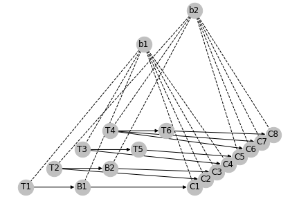
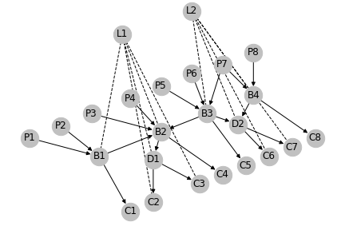
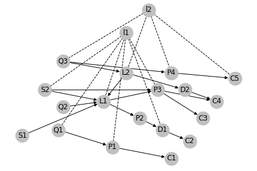

# Human Trafficking Interdiction Model
The goal of this repository is to develop interdiction models for Human Trafficking networks by modeling them as a supply chain. The initial network structures were developed by Dr. Felipe Aros-Vera of Ohio and come from three US court cases.
1. USA vs Johnson

2. USA vs USAvsFlorez

3. USA vs Mendez Hernandez

## ToDo's in this project:
* Incorporate growth rates as defined in Combating Human Trafficking Using mathematics. (2016). Retrieved from https://dsc.duq.edu/urss/2016/proceedings/3
* Model networks dynamically with link probabilities for broken connections due to interdiction attempts
* Graphically represent knowledge and physical domains
* Apply reinforcement learning for all people as a multi-agent environment
  - Create agents interaction rules, roles, and objectives
  - Create environment as relationship graph if possible

## Basic Setup
* Objective function is MinMax problem
  - Traffickers attempting to maximize victim flow
  - Police attempting to minimize victim flow
* Victim flow must be >= total number of victims
* Victim flow into node == victim flow out of node
* Flow is capacitated between nodes
* Edge availability is determined by edge activation

### Case Overviews
1. USAvsJohnson (Internet, Hybrid)
   - Traffickers
     - Control and Transport
     - Capacity 1-3
   - Bottoms
     - Transport and Supervise
     - Post online and connect to pimps
     - Capacity 1
2. USAvsFlorez (Brothels, Tenancingo)
   - Pimps
     - Subcontract to Brothels
     - Capacity 5-10
   - Leaders
     - Coordinate transitions
   - Brothels
     - Major demand point, transitions
     - Capacity 10-25
   - Drivers
     - Transitions
     - Capacity 6-8
   - Other Locations
     - Demand point
     - Capacity 2-4
3. USAvsMendezHernandez (Farms/Bars, International Transitions)
  - Suppliers
    - Supply, transport, and connection
    - Capacity 3-4
  - Pimps
    - Supply and use stash houses
    - Capacity 3-4
  - Ring Leaders
    - Recieve, distribute, and Coordinate
    - Capacity 3-8
  - Local Pimps
    - Recieve, distribute, retain
    - Capacity 1-5
  - Drivers
    - transport
    - Capacity 2
  - Destinations
    - Demand points
    - Capacity 2-3
